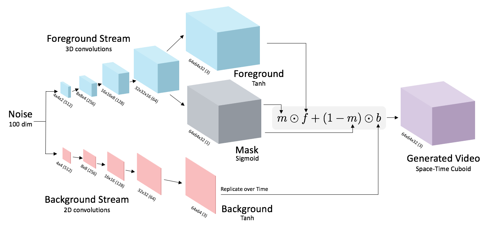
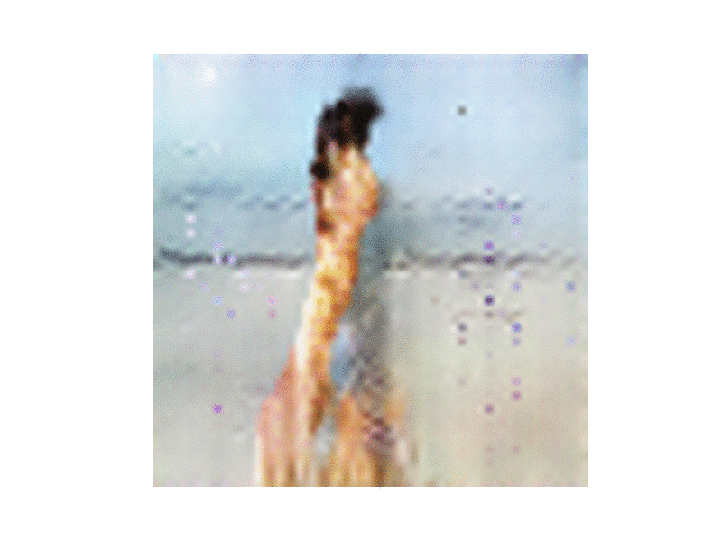
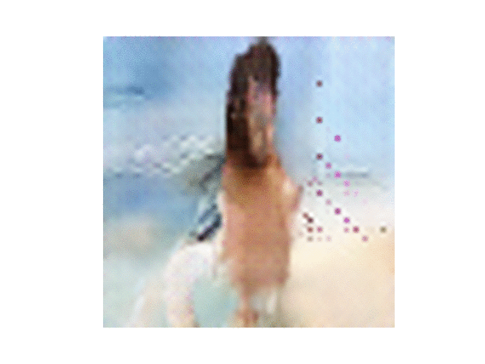
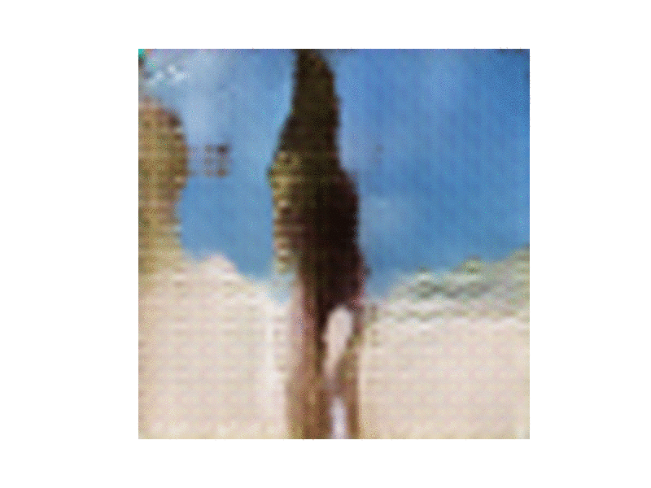

# chainer-videogan

A chainer version of [Generating Videos with Scene Dynamics](http://web.mit.edu/vondrick/tinyvideo/)

The network of Generator is as follows.



## 1. Use the original data

### Data

Please download [here](http://data.csail.mit.edu/videogan/golf.tar.bz2) and extract in "data" directory.

```
cd data
wget http://data.csail.mit.edu/videogan/golf.tar.bz
tar xvf golf.tar.bz2
```

### Training

```
python train.py
```

## 2. Use youtube video

### Data

Download videos from youtube with the following command.

```
cd data
python download_videos.py
```

The videos are saved in "data" directory.

### Training

```
python train.py -v
```

### Result

300 epoch results

<table>
<tr>
<td></td>
<td></td>
<td></td>
</tr>
<tr>
<td></td>
<td></td>
<td></td>
</tr>
<tr>
<td></td>
<td></td>
<td></td>
</tr>
</table>
